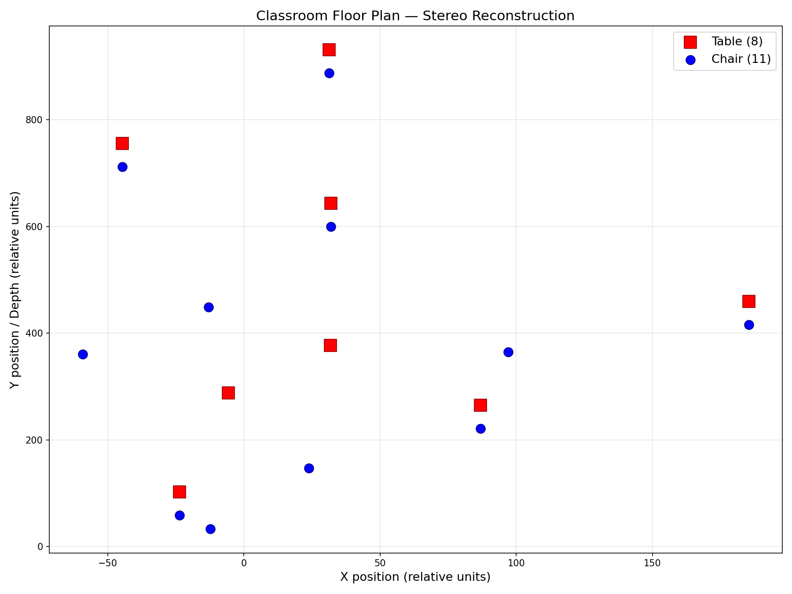

# Stereo Classroom Object Localization

Compute 2D floor-plane locations of tables and chairs in a classroom using a simple stereo camera setup, then visualize them on an X-Y bird's-eye plot (tables in red, chairs in blue).

## Output



- **Red squares** = Tables (8 detected)
- **Blue circles** = Chairs (11 detected)
- Axes are in relative units (no absolute calibration available)

## How It Works

### Pipeline Overview

```
Detect objects in ALL 5 images (YOLOv8)
        |
        v
Stereo pair C1 + C5 (landscape)
        |
        ├──> SIFT feature matching ──> Essential Matrix
        |
        └──> Match detections across views (Hungarian algorithm)
                    |
                    ├── High disparity ──> depth = focal / disparity
                    |
                    └── Low disparity  ──> depth from y-position (linear fit)
                                |
                                v
                    Infer missing desks from chair positions
                                |
                                v
                    Outlier filter (MAD) ──> Plot floor plan
```

### Step-by-step

1. **Detect objects in all 5 images** -- YOLOv8-medium runs on all five classroom photos. Chair detections use confidence >= 0.15; table detections use a very low 0.05 threshold to catch as many desks as possible (COCO's "dining table" class is a poor match for small classroom desks). Across all images: 21 tables and 88 chairs detected at these thresholds.

2. **Stereo geometry** -- C1.jpeg (left) and C5.jpeg (right) form the landscape stereo pair. SIFT extracts ~6300/7000 keypoints, FLANN matching with Lowe's ratio test yields ~3055 good correspondences, and the Essential Matrix is computed via RANSAC (2440 inliers).

3. **Match detections across views** -- The Hungarian algorithm finds optimal 1-to-1 matches between C1 and C5 detections. Constraints: same class, vertical proximity < 100px (epipolar constraint), bounding box size similarity. Result: 18 matched pairs (2 tables, 16 chairs).

4. **Compute depth (two-pass)**:
   - **Pass 1 (stereo disparity)**: For matched pairs with sufficient horizontal parallax (> 0.8 px), compute `depth = focal_length / |disparity|`. This gives reliable depth for 12 objects.
   - **Pass 2 (y-position fallback)**: For the remaining 4 pairs with near-zero disparity (objects too far away for measurable parallax), fit a linear model `depth = a * y_pixel + b` using the Pass 1 results, then estimate depth from image y-position. This recovers objects the stereo baseline is too small to resolve.

5. **Outlier removal** -- Median Absolute Deviation (MAD) filter at 4x removes 3 extreme points.

6. **Infer missing desks** -- Every chair in this classroom has a desk directly in front of it. For each chair without a nearby table detection, a desk is placed at the same X position and slightly greater depth (12% of median chair depth). This inferred 6 additional desks.

7. **Plot** -- `matplotlib` renders the 2D bird's-eye floor plan.

### Why YOLO Misses Most Tables

YOLO's COCO "dining table" class was trained on large, fully-visible tables. Classroom desks are small, narrow, and heavily occluded by students and laptops. Even at 0.05 confidence, only 2 tables per image are reliably detected (vs 15-20 chairs at 0.15). The spatial inference step compensates for this by deriving desk positions from the well-detected chairs.

## Input Images

Five classroom photos in `classroom_images/`:

| Image | Resolution | Orientation | Role |
|-------|-----------|-------------|------|
| C1.jpeg | 4032x3024 | Landscape | **Left** stereo view |
| C2.jpeg | 3024x4032 | Portrait | Detection only |
| C3.jpeg | 3024x4032 | Portrait | Detection only (best table detection: 8 tables) |
| C4.jpeg | 3024x4032 | Portrait | Detection only |
| C5.jpeg | 4032x3024 | Landscape | **Right** stereo view |

## How to Run

```bash
python3 -m venv venv
source venv/bin/activate
pip install -r requirements.txt
python3 stereo_classroom.py
```

Output: `classroom_floorplan.png`

## Dependencies

- `opencv-python` / `opencv-contrib-python` -- SIFT, Essential Matrix, stereo geometry
- `ultralytics` -- YOLOv8 object detection
- `matplotlib` -- 2D plotting
- `numpy`, `scipy` -- Numerical computation, Hungarian algorithm

## Results Summary

| Metric | Value |
|--------|-------|
| SIFT keypoints | ~6300 / ~7000 per image |
| Good feature matches | 3055 |
| Essential matrix inliers | 2440 |
| Cross-view matched pairs | 18 (2 tables, 16 chairs) |
| Stereo depth (disparity) | 12 objects |
| Y-fit depth (fallback) | 4 objects |
| Inferred desks | 6 |
| **Final: tables** | **8** |
| **Final: chairs** | **11** |

## Project Structure

```
cv_w8/
├── classroom_images/
│   ├── C1.jpeg          # Left stereo image
│   ├── C2.jpeg
│   ├── C3.jpeg          # Best table detection
│   ├── C4.jpeg
│   └── C5.jpeg          # Right stereo image
├── stereo_classroom.py  # Main pipeline
├── requirements.txt     # Dependencies
├── classroom_floorplan.png  # Output floor plan
└── README.md
```

## Key Assumptions

| Parameter | Value | Rationale |
|-----------|-------|-----------|
| Focal length | `0.85 * image_width` px | Typical smartphone ~26mm equivalent |
| Principal point | Image center | Standard assumption |
| Min disparity | 0.8 px | Below this, use y-fit fallback |
| Desk offset | 12% of median chair depth | Desks are directly in front of chairs |

## Limitations

- **Relative coordinates**: Without a known baseline distance, all positions are in relative units. Spatial arrangement is correct but not to absolute scale.
- **Small baseline**: C1 and C5 were taken with a very small horizontal shift, limiting stereo accuracy for far-field objects. The y-position fallback mitigates this.
- **Table detection**: COCO's "dining table" class fundamentally mismatches classroom desks. Spatial inference from chairs is the primary source of desk locations.
